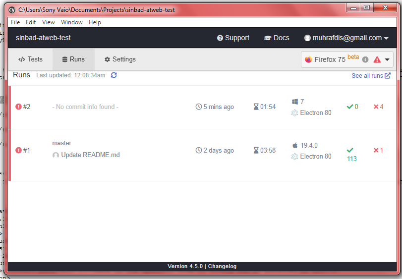

# sinbad-atweb-test
AT Web for Sinbad Test

### How to Getting Started:

```sh
$ git clone "url this project"
$ cd cypresswithcucumber
$ npm install
$ cp .env.example .env
```
If the 'cp' command cannot run, just make a .env file and copy-paste from .env.example file

### How to Run:

- use `test` to upload the report on cypress dashboard
- use `cypress` for local testing (not uploading the report)

```sh
$ npm run cypress                                   | All test
$ npm run cypress -- -e TAGS='@test'                | Only scenario with tag @test (somehow cannot run this command in windows)
$ npm run cypress -- -e TAGS='' --browser chrome    | Launch the browser (unfortunately somehow cannot run in windows)
$ npm run cypress-ui                                | Open the Cypress Desktop from node_modules
```
### Cypress Window

When you run `$ npm run cypress-ui` the Cypress Window will open.
    

Here you can see all menus, all features (here I use cucumber) and browser selection (top right). You can run all test or run per file simply by clicking on the feature file.

### About the assignment

For each problem I create file .feature with total of 5 scenario (plus 1 in problem A). 
For the [Must Have] section I have created Scenario Outline for Search City (problem A) and for Verify the Visa Invoice (problem B).

Here is the example for the Search City test case:
```sh
@guestUser @useCase1 @searchName
  Scenario Outline: As a Guest User, I should be able to search Hotels in a City
    Given I go to PHPtravel homepage
    When I input "<city>" in search destination field
    And I click the add Child button once
    And I click the Search button
    Then I can see the result of Hotels list in "<city>"

    Examples:
    |city       |
    |surabaya   |
    |bandung    |
```

For the reporting I use the Cypress Desktop/Dashboard. So after each run using `npm run test`, the result is uploaded to my Cypress Project. The report can also be viewed by login to Cypress website and go to https://dashboard.cypress.io/projects/mj1hti/runs (this is my own Cypress dashboard)
    

For the [Good to Have] the Cypress Window has the setup to choose which browser do you want to use to run the test. The weakness is Cypress only show the list of browsers in your machine. Unfortunately for the command line, it somehow won't work with windows by using `--browser chrome` but works just fine in Macbook (office's notebook. I returned it so I continue working this with my windows PC). Not just that command, some of the command that can run in Macbook cannot run in my Windows PC, and I still cannot find the workaround about it.
    

The Electron is browser built-in by Cypress

And for the result. All of my tests failed, and I still can't find the solution of the problem.
    
    
That's all I got. I apologize I cannot make it running fine as I want
